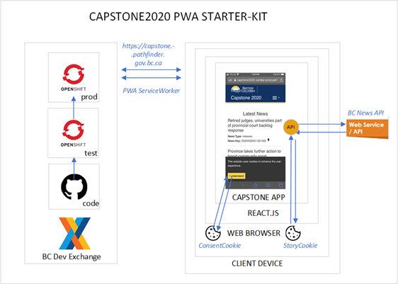

<!--
 * @Author: your name
 * @Date: 2020-07-28 22:06:43
 * @LastEditTime: 2020-07-29 14:45:02
 * @LastEditors: Please set LastEditors
 * @Description: In User Settings Edit
 * @FilePath: \undefinedc:\Users\Mark\Desktop\md\docs\README.md
--> 
# Capstone2020, a Progressive Web App “starter-kit”

## Introduction

This solution is a react.js based client that consumes a DataBC API.

<em>Capstone2020 is an application that provides a starter-kit for BC Gov programme areas to launch a user installable mobile app with the ability to deliver information to users, or to collect information from users as part of a digital solution. This guide is a designed as a series of tutorials.</em>

## Prerequisites
It is assumed that your team is familiar with modern web based programming languages and techniques. This solution was developed using:

* [react.js](https://reactjs.org/docs/getting-started.html) framework and,

* makes use of [redux.js](https://redux.js.org/)

* an understanding of [Progressive Web Applications](https://web.dev/progressive-web-apps/) will help     

## How we developed the 'PWA starter kit'

During the summer of 2020 working with a developer team from Camosun College we designed and developed this starter kit as part of the Capstone2020 project sponsored by CITZ OCIO-ES Information Management Branch (IMB). The project included two key deliverables:

* ## Modern Application Playbook

    We developed our solution by following the CITZ IMB Modern application [playbook](https://bcgov.github.io/CITZ-IMB-playbook/) which describes a collection of references, tools, and best practices starting from product ideation, project approval, team formation, design, development stages through continuous improvement to the product sustainment lifecycle which our Agile team relied upon.

* ## PWA Starter-kit

    This 'starter kit' was developed as a playbook "exemplar". We developed on the [BC DevExchange](D:\capstone2020\bcdevechange.org) OpenShift container platform and follow community best practices including adherence to the 12 factor approach. 

## Twelve Factors

This solution conforms to the principles of cloud ready solution development and follows the twelve factors approach. We describe how we conform in this [article](./TwelveFactor.md).

# Features

1. **Installable mobile solution:**  <em>the Capstone2020 starter kit web site was designed to be a user installable mobile solution. When the user visits the landing page they are asked if they wish to install the solution locally. The mechanics of how this I done is handled by the progressive Web App (PWA) framework.</em>

2.  **User Session:** <em>the first time the user comes to the site they are asked to accept a consent cookie. Since our starter-kit has no user authentication module we use a cookie to track a user. The user is given the option to end a session which clears out all cookies.</em>

3.	**DataBC API:** <em>the starter-kit demonstrates a fetch of the BC News API and displays news headings and stories which can be filtered based on story options. These options are controlled by the user via a drop down menu selection.</em>

4.	**Favorites/Save Story/Delete Story:** <em>a user can ‘tag’ story’s (using the pin icon) which **saves** the story (based on the story identifier) that can be retrieved and displayed when the user selects **'Favorites'** from the drop down menu. The user can **delete** a saved story from their selection list by selecting the trash can icon.</em>

5.	**Light/Dark Mode:** <em>a user can toggle between a day (light) and night (dark) mode by selecting the **Dark/Light** Mode option from the drop down menu.</em>

6.	**About:** <em>a user can view details about the solution by selecting the **About** option from the drop down features menu.</em>

# Solution Architecture

The 'PWA starter kit' is based upon the create-react-app solution from Facebook developed using react.js. This ‘start-kit’ provides product owners with a foundation to develop mobile applications. The key elements which are provided include:

1.	**BCGov Branding (Header/footer):** at this stage, the request has a status of **in-review**. Only at this stage can a user edit or delete the request, i.e. the edit and delete buttons are only visible on the request page at this stage. For the admin, they can either approve or disapprove the request, i.e. the request view page will show only the buttons for approval and disapproval.

2.	**Menu System:** <em>once the request has been approved the status changes to **pending** and, the user can no longer edit or delete it. For the admin, there will be a button on the request page to resolve the request.</em>

3.	**App Shell:** <em>when a request is disapproved by an admin, the status changes to **disapproved** and no further action can be performed on it by either the user or admin.</em>

 

The Capstone app is a progressive web app that can be user installed on Android devices.

Using a call back serviceworker script which maintains a connection with the hosting environment thereby allowing the user to be notified when solution updates are deployed.

## App Start: 

## Selecting features:

###	Key files:

To view the file folder structure and hierarchy review the [build.md](./build.md) file

The main files you will familiarize youself with are: 

[./.env](https://github.com/bcgov/CITZ-IMB-Capstone2020/blob/master/.env) : where the news API located.

[./public/](https://github.com/bcgov/CITZ-IMB-Capstone2020/tree/master/public)

* [index.html](https://github.com/bcgov/CITZ-IMB-Capstone2020/blob/master/public/index.html) : solution entry point

* [manifest.json](https://github.com/bcgov/CITZ-IMB-Capstone2020/blob/master/public/manifest.json) : where you have to update the icon based on different display sizes.

[./src/](https://github.com/bcgov/CITZ-IMB-Capstone2020/tree/master/src)

* [./views](https://github.com/bcgov/CITZ-IMB-Capstone2020/tree/master/src/views) : solution code files.

* [./css](https://github.com/bcgov/CITZ-IMB-Capstone2020/tree/master/src/css) : solution style files.

* [./index.js](https://github.com/bcgov/CITZ-IMB-Capstone2020/blob/master/src/index.js) :  where you have to register the service worker.

# Data Architecture

* The data return from [NewsAPI](https://catalogue.data.gov.bc.ca/dataset/bc-gov-news-api-service/resource/3692fd5e-87e2-47ab-8eee-9131ea249436) : Key-value pairs in JSON format.

* The data **after* converting JSON format in [FetchLatestNews.js](https://github.com/bcgov/CITZ-IMB-Capstone2020/blob/master/src/views/FetchLatestNews.js) ( line:30 ): String Array

* Cookie [FetchLatestNews.js](https://github.com/bcgov/CITZ-IMB-Capstone2020/blob/master/src/views/FetchLatestNews.js) ( line:23 ): String Array

# Technologies used

1.	[React](https://reactjs.org/), a JavaScript library for building user interfaces. This is the main tool used to build the client application.

2.	[Redux](https://redux.js.org/), a state management library for JavaScript applications. Is used by the ServiceWorker module to manage the state of the application. As described in [this article](https://medium.com/better-programming/let-users-know-when-you-have-updated-your-service-worker-in-create-react-app-b0c2701995b3).

3.	[NPM](https://www.npmjs.com/), a package manager for JavaScript. Used to manage the packages that create the Capstone2020 starter-kit app. NPM provides command line tools to run scripts that perform or automate certain functions such as starting the server and running tests.

4.	[Webpack](https://webpack.js.org/), a module bundler for mobile applications. Used as a build tool to bundle  JS and CSS files into a single file. Also used to set up a dev server for local development.

5.	[OpenShift](https://www.openshift.com/) , a hosting environment wich includes the runtime container and REST API, coordination, and web interfaces to deploy and manage individual containers

6.	[Jenkins](https://www.jenkins.io/), a deployment pipeline described how to test, build, and deploy app from GitHub to OpenSHift

7.	[GitHub](https://github.com/) a the source code repository 

# Additional technologies you may want to use

1.	[Node.js](https://nodejs.org/), a JavaScript runtime for building server-side JavaScript applications.

2.	[Express](https://expressjs.com/), a web framework for Node.js. 

3.	[Babel](https://babeljs.io/), a toolchain used to convert ES5+ code into backwards-compatible JavaScript code for current or older browsers.

4.	[Jest](https://jestjs.io/) and [Enzyme](https://github.com/airbnb/enzyme), testing utilities for JavaScript and React applications.

5.	[ESLint](https://eslint.org/), a linter tool for pattern identification and reporting in JavaScript, which I used alongside the [Airbnb style guide](https://github.com/airbnb/javascript).

6.	[MongoDB](https://www.mongodb.com/), a document database with the scalability and flexibility that you want with the querying and indexing that you need.

7. [Postgress](https://www.postgresql.org/about/), a powerful, open source object-relational database system.

8.	[Redis](https://redis.io/topics/introduction), an open source, in-memory data structure store, used as a database, cache and message broker. 

**A full list of the tools and technologies used in this project is available in the <em>package.json</em> file.**

# Possible solution enhancements

1.	**User Stories**,  maintaining a user story catalogue ensures that developed features align to value statements and identify enhancement opportunities.

2.	**Push notification**, incorporate a communication channel to the user notifying them of specific features , service availability windows, feedback channels. PWA architecture supports this ability.

3.	**Testing**, due to time considerations we did not develop a robust suite of tests using jest or Enzyme. You should!

4.	**Logging**, on the roadmap but not implemented. Incorporate analytics by logging events that will provide information about the user experience. Consider using the winston library and logging  your event streams to the IMB Logstash collector. 

5.	**Menu system**, consider implementing a sliding menu as is common in most mobile apps

6.	**Database**, the starter kit would benefit by having a backing database service and the use of Redux (or equiv) robust data handling.

7.	**Oauth**, there are use cases where user authentication is a requirement

# Contributing

This is an open-source project licensed under the Apache licensing agreement and as such contributions are highly welcome. However, there are some recommended guidelines to follow to ensure proper collaboration by everybody. Before we get to those, however, here is how you will get the project set up on your local development system (first ensure you have Node and npm installed):

## Getting set up

Follow the [Build Solution on your Local Environment](./build.md) tutorial.

Everything you need to know about this can be found in the tutorial. It includes formats for commit messages, branch naming and PR description.

## Deploying to OpenShift
Follow the Deploy to openshift tutorial.

* [Morden web apps to OpenShift Part 1 - Web apps in two commands](https://developers.redhat.com/blog/2018/10/04/modern-web-apps-openshift-part-1/)

* [Morden web apps to OpenShift Part 2 - chained builds](https://developers.redhat.com/blog/2018/10/23/modern-web-applications-on-openshift-part-2-using-chained-builds/)

* [Morden web apps to OpenShift Part 3 - development environment](https://developers.redhat.com/blog/2019/01/17/modern-web-applications-on-openshift-part-3-openshift-as-a-development-environment/)

* [Morden web apps to OpenShift Part 4 - Pipelines](https://developers.redhat.com/blog/2020/04/27/modern-web-applications-on-openshift-part-4-openshift-pipelines/)

Everything you need to know about this can be found in the tutorial.

## Maintaining your solution

Follow the [Maintain Capstone2020 Solution App](./maintain.md) tutorial

Everything you need to know about this can be found in the tutorial. It includes formats for commit messages, branch naming and PR description.

### Useful links

* CITZ IMB Modern Application Playbook 

    https://bcgov.github.io/CITZ-IMB-playbook/

* PWA 

    https://www.youtube.com/watch?v=IaJqMcOMuDM

    https://medium.com/progressive-web-apps/pwa-create-a-new-update-available-notification-using-service-workers-18be9168d717

* Service Workers 

    https://create-react-app.dev/docs/making-a-progressive-web-app/

    https://developers.google.com/web/fundamentals/primers/service-workers

* BC News API 

    https://catalogue.data.gov.bc.ca/dataset/bc-gov-news-api-service/resource/3692fd5e-87e2-47ab-8eee-9131ea249436

* BC DevExchange

    https://bcdevexchange.org/

* React Architecture

     https://www.simform.com/react-architecture-best-practices/