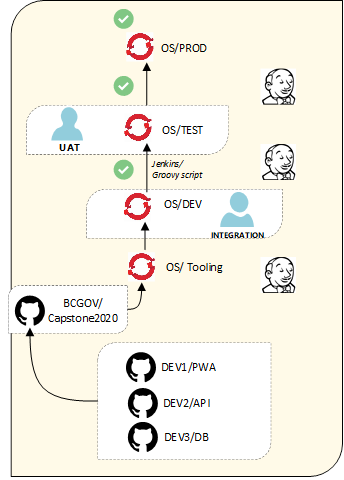
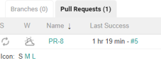
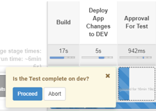

<!--
 * @Author: your name
 * @Date: 2020-07-28 00:06:04
 * @LastEditTime: 2020-07-28 01:01:49
 * @LastEditors: Please set LastEditors
 * @Description: In User Settings Edit
 * @FilePath: \undefinedc:\Users\Mark\Desktop\md\deploy.md
--> 
# Capstone Solution Publishing Workflow

# Introduction

The following workflow explains what is the process of creating, pushing, and deploying Capstone2020 solution app from local -> github -> Jenkins -> OpenShift.

## Expected flow workflow.png

## Recorded Processes: 
Important files: 
https://github.com/bcgov/CITZ-IMB-Capstone2020/tree/master/.jenkins 
https://github.com/bcgov/CITZ-IMB-Capstone2020/tree/master/.openshiftio 
https://github.com/bcgov/CITZ-IMB-Capstone2020/blob/master/Jenkinsfile 

## Check out [maintain.md](./maintain.md) for step 1 - 4
### Step 1: **Develop in a local environment**

### Step 2: **Push code to the shared repo**

### Step 3: **Send pull request to master branch**

### Step 4: **Reviewer Approval**

### Step 5: **Start the Pipeline (you need admin authorization to do so)** 

1. Go to the Jenkins Pipeline console
    https://jenkins-dev-1-xordpe-tools.pathfinder.gov.bc.ca/

2. Click the Capstone2020 solution app  
    

3. Click the pull request and select the most recent PR-# (ex: 8)  
    

4. Review the latest pull request 
    

5. Jenkins completes the process for “Deploy App Changes to DEV” automatically, solution changes should take effect 
    

6. Left click the blue box under “Approval for test”, select proceed 
    

7. Repeat the above process for the other tasks

### Step 6: **Process Validation**

1. Build process completes (when all process boxes are green) 
    

### Step 7: **Return to GitHub and complete the merge request**

### Step 8: **Solution Updated**

1. Review the published solution on OpenShift was updated based on the code changes that were pushed to the gov master repo
